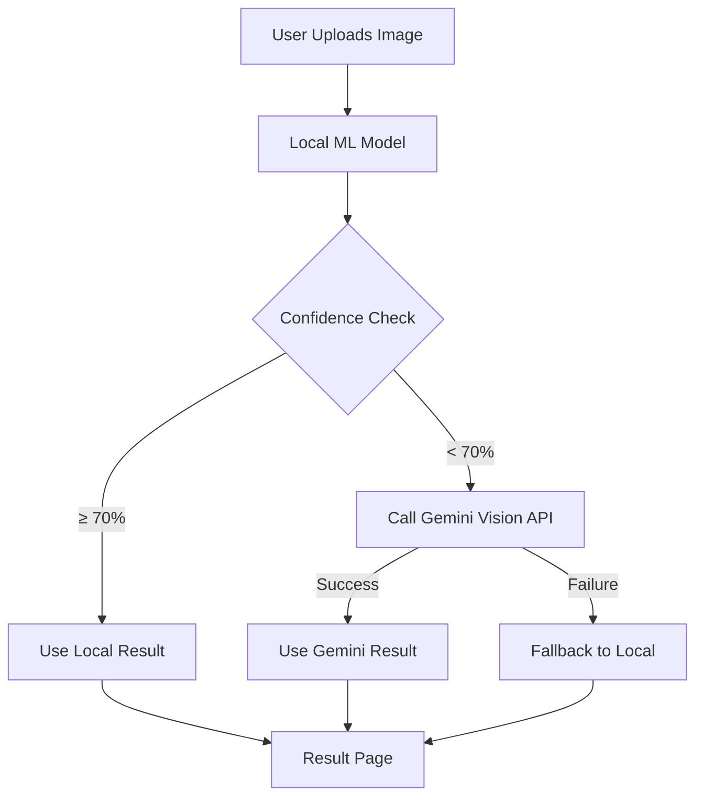

# Hybrid AI Architecture — Implementation Complete 🎉

The AI Recipe Generator now uses a **Hybrid AI Architecture** that combines the existing InverseCooking local model with Google Gemini Vision API as an intelligent fallback.

## Architecture: Before vs After



## Files Created

| File | Purpose |
|------|---------|
| [.env](file:///f:/Projects/Recipe-Generation-from-Food-Image/.env) | API key and config (GEMINI_API_KEY, thresholds) |
| [services/__init__.py](file:///f:/Projects/Recipe-Generation-from-Food-Image/Foodimg2Ing/services/__init__.py) | Services package init |
| [services/gemini_service.py](file:///f:/Projects/Recipe-Generation-from-Food-Image/Foodimg2Ing/services/gemini_service.py) | Gemini Vision API integration with caching |
| [services/hybrid_predictor.py](file:///f:/Projects/Recipe-Generation-from-Food-Image/Foodimg2Ing/services/hybrid_predictor.py) | Decision engine (local vs Gemini) |
| [services/prediction_logger.py](file:///f:/Projects/Recipe-Generation-from-Food-Image/Foodimg2Ing/services/prediction_logger.py) | JSONL logging to `logs/predictions.jsonl` |

## Files Modified

| File | Change |
|------|--------|
| [__init__.py](file:///f:/Projects/Recipe-Generation-from-Food-Image/Foodimg2Ing/__init__.py) | Added `python-dotenv` loading at startup |
| [output.py](file:///f:/Projects/Recipe-Generation-from-Food-Image/Foodimg2Ing/output.py) | Extended to return confidence scores from real model probabilities |
| [routes.py](file:///f:/Projects/Recipe-Generation-from-Food-Image/Foodimg2Ing/routes.py) | Rewired to use `hybrid_predictor.predict()` |
| [result.html](file:///f:/Projects/Recipe-Generation-from-Food-Image/Foodimg2Ing/Templates/result.html) | Added source badge, confidence meter, and Gemini second opinion view |
| [requirements.txt](file:///f:/Projects/Recipe-Generation-from-Food-Image/requirements.txt) | Added `google-generativeai`, `python-dotenv` |
| [.gitignore](file:///f:/Projects/Recipe-Generation-from-Food-Image/.gitignore) | Added `logs/` |

## How Confidence Scoring Works

The confidence is computed from **real model output tensors**, not heuristics:

1. **Ingredient Probability (50% weight)**: Mean of the max softmax probabilities across predicted ingredient tokens from `ingr_probs`.
2. **Diversity Score (30% weight)**: The ratio of unique tokens in the recipe output (already computed in `prepare_output()`).
3. **Validity Bonus (20% weight)**: 1.0 if the recipe passed all quality checks, 0.0 otherwise.

Formula: `confidence = 0.5 × ingr_prob + 0.3 × diversity + 0.2 × validity`

## Configuration (.env)

```bash
GEMINI_API_KEY=YOUR_KEY_HERE       # Replace with your real Gemini API key
USE_GEMINI_FALLBACK=True           # Enable/disable Gemini fallback
CONFIDENCE_THRESHOLD=0.70          # Below this, Gemini is called
ENABLE_SECOND_OPINION=False        # Show both results side-by-side
```

## How to Test

### Without Gemini (works out of the box)
1. Leave `GEMINI_API_KEY=YOUR_KEY_HERE` in `.env`
2. Restart the server: `python run.py`
3. Upload any image → local model runs, confidence shown, source = "Local AI Model"

### With Gemini Enabled
1. Get a Gemini API key from [Google AI Studio](https://aistudio.google.com/apikey)
2. Set `GEMINI_API_KEY=your_real_key` in `.env`
3. Restart the server
4. Upload a difficult image → if confidence < 70%, Gemini kicks in automatically

### Second Opinion Mode (for demos)
1. Set `ENABLE_SECOND_OPINION=True` in `.env`
2. Both local and Gemini results appear side-by-side on the result page
